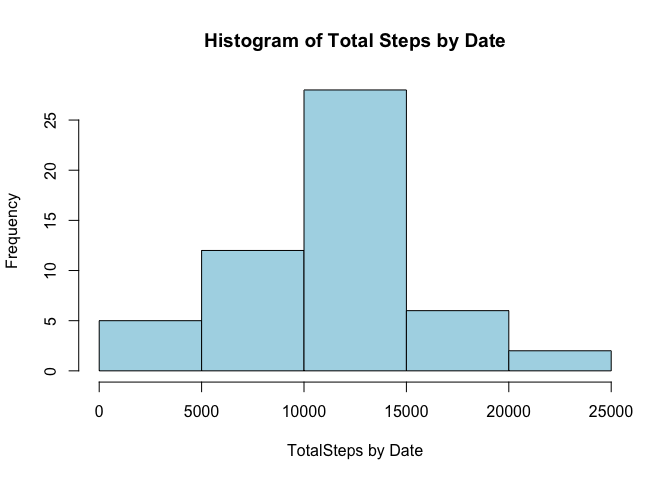
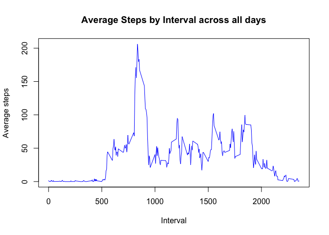
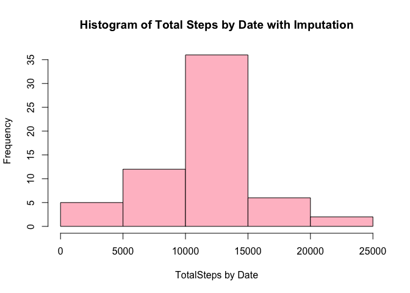
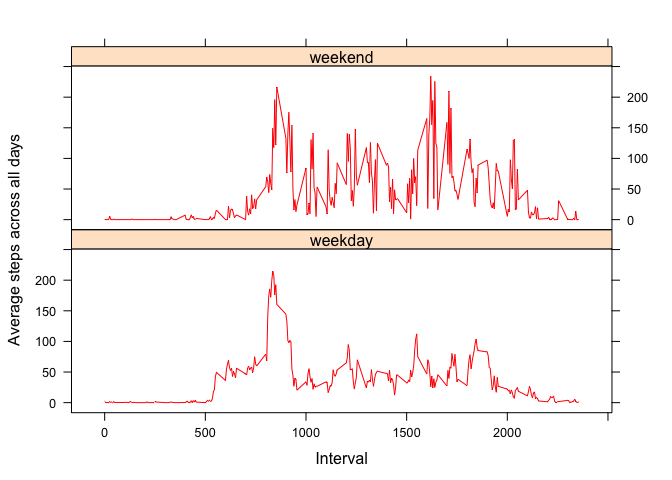

###                                   Title: Reproducible Research Peer Assessment 1

Author: Suma Krishnaprasad  
Date: November 15, 2014  

This assignment makes use of data from a personal activity monitoring device. This device collects data at 5 minute intervals through out the day. The data consists of two months of data from an anonymous individual collected during the months of October and November, 2012 and include the number of steps taken in 5 minute intervals each day.

The following analysis provides answers to various analytical questions posed.

**Loading and pre-processing the data:**

```r
library(lattice)

##read file and remove NAs
aDataOrig<-read.csv("activity.csv",colClasses=c('numeric','Date','numeric'))
aData<-aDataOrig[complete.cases(aDataOrig),]
```

**Mean total number of steps taken per day**

```r
## Aggregate by date
aDatabyday<-aggregate(aData$steps ~ aData$date,data=aData,FUN=sum)
colnames(aDatabyday)<-c("Date","TotalSteps")

##Plot histogram
par(mfrow=c(1,1))
hist(as.numeric(aDatabyday$TotalSteps), xlab="TotalSteps by Date", main="Histogram of Total Steps by Date", col="light blue")
```

 

**Mean steps taken by day:**

```r
##Calc mean by date
aDataMeanbyday<-aggregate(aData$steps ~ aData$date,data=aData,FUN=mean)
colnames(aDataMeanbyday)<-c("Date","MeanSteps")
print(aDataMeanbyday)
```

```
##          Date  MeanSteps
## 1  2012-10-02  0.4375000
## 2  2012-10-03 39.4166667
## 3  2012-10-04 42.0694444
## 4  2012-10-05 46.1597222
## 5  2012-10-06 53.5416667
## 6  2012-10-07 38.2465278
## 7  2012-10-09 44.4826389
## 8  2012-10-10 34.3750000
## 9  2012-10-11 35.7777778
## 10 2012-10-12 60.3541667
## 11 2012-10-13 43.1458333
## 12 2012-10-14 52.4236111
## 13 2012-10-15 35.2048611
## 14 2012-10-16 52.3750000
## 15 2012-10-17 46.7083333
## 16 2012-10-18 34.9166667
## 17 2012-10-19 41.0729167
## 18 2012-10-20 36.0937500
## 19 2012-10-21 30.6284722
## 20 2012-10-22 46.7361111
## 21 2012-10-23 30.9652778
## 22 2012-10-24 29.0104167
## 23 2012-10-25  8.6527778
## 24 2012-10-26 23.5347222
## 25 2012-10-27 35.1354167
## 26 2012-10-28 39.7847222
## 27 2012-10-29 17.4236111
## 28 2012-10-30 34.0937500
## 29 2012-10-31 53.5208333
## 30 2012-11-02 36.8055556
## 31 2012-11-03 36.7048611
## 32 2012-11-05 36.2465278
## 33 2012-11-06 28.9375000
## 34 2012-11-07 44.7326389
## 35 2012-11-08 11.1770833
## 36 2012-11-11 43.7777778
## 37 2012-11-12 37.3784722
## 38 2012-11-13 25.4722222
## 39 2012-11-15  0.1423611
## 40 2012-11-16 18.8923611
## 41 2012-11-17 49.7881944
## 42 2012-11-18 52.4652778
## 43 2012-11-19 30.6979167
## 44 2012-11-20 15.5277778
## 45 2012-11-21 44.3993056
## 46 2012-11-22 70.9270833
## 47 2012-11-23 73.5902778
## 48 2012-11-24 50.2708333
## 49 2012-11-25 41.0902778
## 50 2012-11-26 38.7569444
## 51 2012-11-27 47.3819444
## 52 2012-11-28 35.3576389
## 53 2012-11-29 24.4687500
```

**Median steps taken by day:**

```r
##Calc median by date
aDataMedianbyday<-aggregate(aData$steps ~ aData$date,data=aData,FUN=median)
colnames(aDataMedianbyday)<-c("Date","MedianSteps")
print(aDataMedianbyday)
```

```
##          Date MedianSteps
## 1  2012-10-02           0
## 2  2012-10-03           0
## 3  2012-10-04           0
## 4  2012-10-05           0
## 5  2012-10-06           0
## 6  2012-10-07           0
## 7  2012-10-09           0
## 8  2012-10-10           0
## 9  2012-10-11           0
## 10 2012-10-12           0
## 11 2012-10-13           0
## 12 2012-10-14           0
## 13 2012-10-15           0
## 14 2012-10-16           0
## 15 2012-10-17           0
## 16 2012-10-18           0
## 17 2012-10-19           0
## 18 2012-10-20           0
## 19 2012-10-21           0
## 20 2012-10-22           0
## 21 2012-10-23           0
## 22 2012-10-24           0
## 23 2012-10-25           0
## 24 2012-10-26           0
## 25 2012-10-27           0
## 26 2012-10-28           0
## 27 2012-10-29           0
## 28 2012-10-30           0
## 29 2012-10-31           0
## 30 2012-11-02           0
## 31 2012-11-03           0
## 32 2012-11-05           0
## 33 2012-11-06           0
## 34 2012-11-07           0
## 35 2012-11-08           0
## 36 2012-11-11           0
## 37 2012-11-12           0
## 38 2012-11-13           0
## 39 2012-11-15           0
## 40 2012-11-16           0
## 41 2012-11-17           0
## 42 2012-11-18           0
## 43 2012-11-19           0
## 44 2012-11-20           0
## 45 2012-11-21           0
## 46 2012-11-22           0
## 47 2012-11-23           0
## 48 2012-11-24           0
## 49 2012-11-25           0
## 50 2012-11-26           0
## 51 2012-11-27           0
## 52 2012-11-28           0
## 53 2012-11-29           0
```

**Mean of Total Steps by day:**  

```r
mean(aDatabyday$TotalSteps)
```

```
## [1] 10766.19
```

**Median of Total Steps by day:** 

```r
median(aDatabyday$TotalSteps)
```

```
## [1] 10765
```

**Average daily activity pattern**  
Time series plot of average number of steps taken every 5-minute interval across all days

```r
##Calc mean by 5-min interval across all days
aDataMeanbyInterval<-aggregate(aData$steps ~ aData$interval,data=aData,FUN=mean)
colnames(aDataMeanbyInterval)<-c("Interval","MeanSteps")

##time series plot of mean by 5-min interval across all days
plot(aDataMeanbyInterval$Interval,aDataMeanbyInterval$MeanSteps,type="l", xlab="Interval", ylab="Average steps", main="Average Steps by Interval across all days", col="blue")
```

 

The 5 minute interval that has the maximum number of total steps taken by date is: 

```r
maxinterval<-aDataMeanbyInterval[aDataMeanbyInterval$MeanSteps==max(aDataMeanbyInterval$MeanSteps),1]
print(maxinterval)
```

```
## [1] 835
```

**Imputing missing values**
Total number of missing values

```r
##total number of missing values
nrow(subset(aDataOrig, is.na(aDataOrig$steps)))
```

```
## [1] 2304
```

Replace missing values with average of steps taken for that interval across all days

```r
##Replace NAs with average by 5 min interval across all days
aDataImput<-merge(aDataMeanbyInterval,aDataOrig, by.x="Interval",by.y="interval",all.y)
aDataImput[is.na(aDataImput$steps),]$steps<-aDataImput[is.na(aDataImput$steps),]$MeanSteps
```

**Plot a histogram of Total steps after imputing values**  

```r
##histogram with imputed values
aDataImputbyday<-aggregate(aDataImput$steps ~ aDataImput$date,data=aDataImput,FUN=sum)
colnames(aDataImputbyday)<-c("Date","TotalSteps")
hist(aDataImputbyday$TotalSteps, xlab="TotalSteps by Date", main="Histogram of Total Steps by Date with Imputation", col="pink")
```

 

**Mean steps taken by day after imputation:**  

```r
##Calc mean by date
aDataImputMeanbyday<-aggregate(aDataImput$steps ~ aDataImput$date,data=aDataImput,FUN=mean)
colnames(aDataImputMeanbyday)<-c("Date","MeanSteps")
print(aDataImputMeanbyday)
```

```
##          Date  MeanSteps
## 1  2012-10-01 37.3825996
## 2  2012-10-02  0.4375000
## 3  2012-10-03 39.4166667
## 4  2012-10-04 42.0694444
## 5  2012-10-05 46.1597222
## 6  2012-10-06 53.5416667
## 7  2012-10-07 38.2465278
## 8  2012-10-08 37.3825996
## 9  2012-10-09 44.4826389
## 10 2012-10-10 34.3750000
## 11 2012-10-11 35.7777778
## 12 2012-10-12 60.3541667
## 13 2012-10-13 43.1458333
## 14 2012-10-14 52.4236111
## 15 2012-10-15 35.2048611
## 16 2012-10-16 52.3750000
## 17 2012-10-17 46.7083333
## 18 2012-10-18 34.9166667
## 19 2012-10-19 41.0729167
## 20 2012-10-20 36.0937500
## 21 2012-10-21 30.6284722
## 22 2012-10-22 46.7361111
## 23 2012-10-23 30.9652778
## 24 2012-10-24 29.0104167
## 25 2012-10-25  8.6527778
## 26 2012-10-26 23.5347222
## 27 2012-10-27 35.1354167
## 28 2012-10-28 39.7847222
## 29 2012-10-29 17.4236111
## 30 2012-10-30 34.0937500
## 31 2012-10-31 53.5208333
## 32 2012-11-01 37.3825996
## 33 2012-11-02 36.8055556
## 34 2012-11-03 36.7048611
## 35 2012-11-04 37.3825996
## 36 2012-11-05 36.2465278
## 37 2012-11-06 28.9375000
## 38 2012-11-07 44.7326389
## 39 2012-11-08 11.1770833
## 40 2012-11-09 37.3825996
## 41 2012-11-10 37.3825996
## 42 2012-11-11 43.7777778
## 43 2012-11-12 37.3784722
## 44 2012-11-13 25.4722222
## 45 2012-11-14 37.3825996
## 46 2012-11-15  0.1423611
## 47 2012-11-16 18.8923611
## 48 2012-11-17 49.7881944
## 49 2012-11-18 52.4652778
## 50 2012-11-19 30.6979167
## 51 2012-11-20 15.5277778
## 52 2012-11-21 44.3993056
## 53 2012-11-22 70.9270833
## 54 2012-11-23 73.5902778
## 55 2012-11-24 50.2708333
## 56 2012-11-25 41.0902778
## 57 2012-11-26 38.7569444
## 58 2012-11-27 47.3819444
## 59 2012-11-28 35.3576389
## 60 2012-11-29 24.4687500
## 61 2012-11-30 37.3825996
```

**Median steps taken by day after imputation:**  

```r
##Calc median by date
aDataImputMedianbyday<-aggregate(aDataImput$steps ~ aDataImput$date,data=aDataImput,FUN=median)
colnames(aDataImputMedianbyday)<-c("Date","MedianSteps")
print(aDataImputMedianbyday)
```

```
##          Date MedianSteps
## 1  2012-10-01    34.11321
## 2  2012-10-02     0.00000
## 3  2012-10-03     0.00000
## 4  2012-10-04     0.00000
## 5  2012-10-05     0.00000
## 6  2012-10-06     0.00000
## 7  2012-10-07     0.00000
## 8  2012-10-08    34.11321
## 9  2012-10-09     0.00000
## 10 2012-10-10     0.00000
## 11 2012-10-11     0.00000
## 12 2012-10-12     0.00000
## 13 2012-10-13     0.00000
## 14 2012-10-14     0.00000
## 15 2012-10-15     0.00000
## 16 2012-10-16     0.00000
## 17 2012-10-17     0.00000
## 18 2012-10-18     0.00000
## 19 2012-10-19     0.00000
## 20 2012-10-20     0.00000
## 21 2012-10-21     0.00000
## 22 2012-10-22     0.00000
## 23 2012-10-23     0.00000
## 24 2012-10-24     0.00000
## 25 2012-10-25     0.00000
## 26 2012-10-26     0.00000
## 27 2012-10-27     0.00000
## 28 2012-10-28     0.00000
## 29 2012-10-29     0.00000
## 30 2012-10-30     0.00000
## 31 2012-10-31     0.00000
## 32 2012-11-01    34.11321
## 33 2012-11-02     0.00000
## 34 2012-11-03     0.00000
## 35 2012-11-04    34.11321
## 36 2012-11-05     0.00000
## 37 2012-11-06     0.00000
## 38 2012-11-07     0.00000
## 39 2012-11-08     0.00000
## 40 2012-11-09    34.11321
## 41 2012-11-10    34.11321
## 42 2012-11-11     0.00000
## 43 2012-11-12     0.00000
## 44 2012-11-13     0.00000
## 45 2012-11-14    34.11321
## 46 2012-11-15     0.00000
## 47 2012-11-16     0.00000
## 48 2012-11-17     0.00000
## 49 2012-11-18     0.00000
## 50 2012-11-19     0.00000
## 51 2012-11-20     0.00000
## 52 2012-11-21     0.00000
## 53 2012-11-22     0.00000
## 54 2012-11-23     0.00000
## 55 2012-11-24     0.00000
## 56 2012-11-25     0.00000
## 57 2012-11-26     0.00000
## 58 2012-11-27     0.00000
## 59 2012-11-28     0.00000
## 60 2012-11-29     0.00000
## 61 2012-11-30    34.11321
```

**Mean of Total Steps by day after imputation:**  

```r
mean(aDataImputbyday$TotalSteps)
```

```
## [1] 10766.19
```

**Median of Total Steps by day after imputation:**   

```r
median(aDataImputbyday$TotalSteps)
```

```
## [1] 10766.19
```

**Analysis**
After imputation, the mean of Total steps remains the same, however the median for total steps is slightly higher. The mean per day is the same, however we now have mean for days that were previously missing due to all NA's. The median per day was 0 for all days earlier, but now we have a median of 34.1 for days that were missing values.
It appears the subject forgot to wear the activity device on certain days and all readings for those days are missing - 10/01/2012, 10/08/2012, 11/01/2012, 11/04/2012, 11/09/2012, 11/10/2012,11/14/2012 and 11/30/2012. The Total steps for these days comes out to 10766.2 based on the imputed values. Henceforth the histogram plot shows higher frequencies for the 10,000 - 15,000 range.

**Activity pattern comparison between weekdays and weekends**

```r
##Add a factor column for weekdays vs weekend
aDataImput$type<-paste("weekday")
aDataImput[which(weekdays(aDataImput$date)==c("Saturday","Sunday")),]$type<-"weekend"

##Calc mean by 5-min interval across all weekdays
aDataImputMeanbyInterval<-aggregate(aDataImput$steps ~ aDataImput$type + aDataImput$Interval,data=aDataImput,FUN=mean)
colnames(aDataImputMeanbyInterval)<-c("type","Interval","MeanSteps")

##time series plot of mean by 5-min interval by type
xyplot(aDataImputMeanbyInterval$MeanSteps~aDataImputMeanbyInterval$Interval | type ,type="l",data=aDataImputMeanbyInterval,layout=c(1,2), col="red", xlab="Interval", ylab = "Average steps across all days")
```

 

**Conclusion**
The activity pattern for weekday vs weekend clearly indicates that the subject is more active on weekends than weekdays. 


